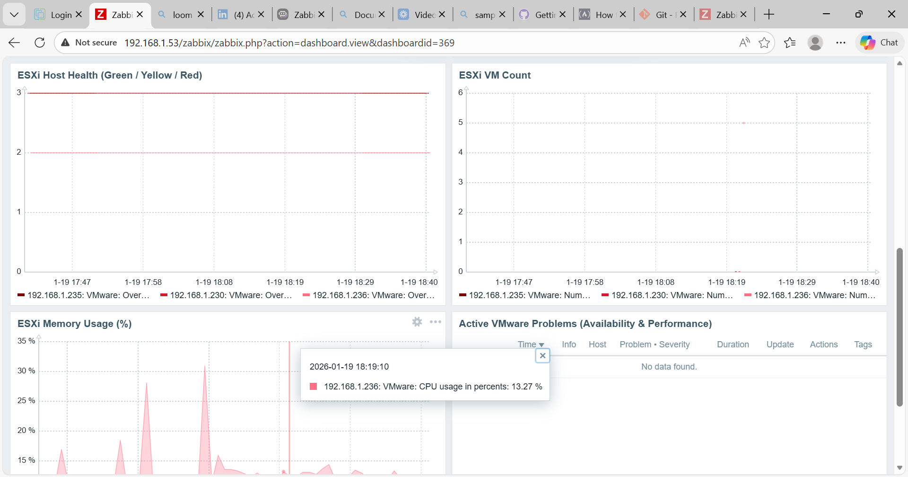
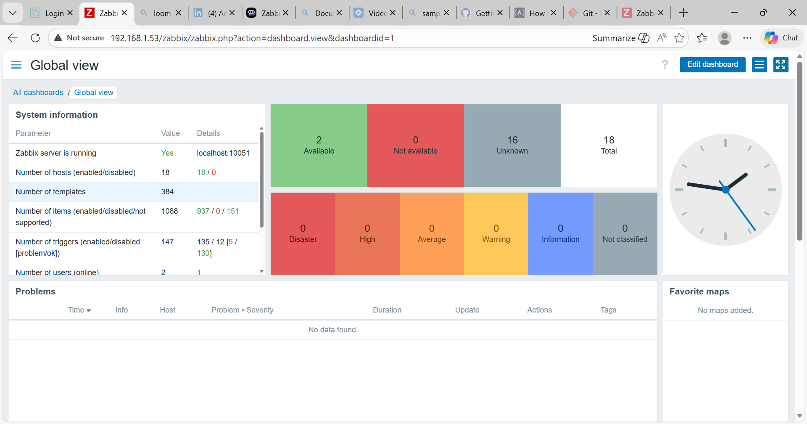

# Dashboards

This directory documents the primary dashboards used to visualize
infrastructure health and alert state within the monitoring system.

Dashboards are used for situational awareness and validation, while
alerting and remediation are driven by triggers and actions.

---

## VMware – Infrastructure Overview

This dashboard provides hypervisor-level visibility for VMware ESXi
hosts, focusing on resource pressure that may impact multiple virtual
machines simultaneously.

Key views include:
- ESXi CPU utilization trends
- ESXi memory pressure and ballooning activity
- Time-windowed analysis for sustained conditions

This view supports early detection of host-level contention before
guest-level alerts escalate.

---

## Global View

The Global View dashboard provides an operational summary of the entire
monitoring environment.

Key elements include:
- Host availability status
- Trigger severity distribution
- Active problem summary
- System health indicators

This dashboard is used for high-level situational awareness and
confirmation that alerting and escalation behaviors are functioning as
expected.

---

## Notes

Dashboards are intentionally documented rather than exported to avoid
environment-specific dependencies. Alerting, remediation, and escalation
logic are defined independently of dashboard configuration.
